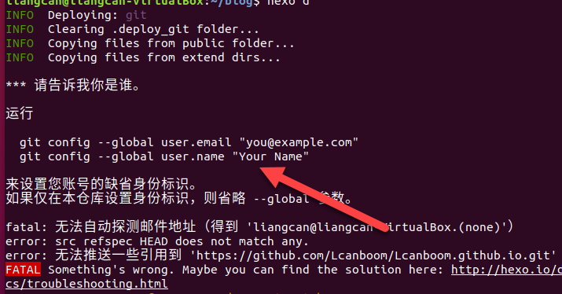

# Hexo

## 用法
**1. 部署**

部署到GitHub上：
> 1.修改_config.yml配置文件中的部署部分信息
> 
> 2.注意：需要安装的依赖：hexo-deployer-git
    
    $ npm install hexo-deployer-git --save

	_config.yml修改

		    deploy:
		    	type: git
		    	repo: 部署的仓库的地址
		    	branch:分支

> 3.上传

    $ hexo d
上传的时候可能需要你进行git的邮箱验证，按提示操作即可

按照提示进行以下操作：

    git config --global user.email "you email address"
    git config --global user.name "your name"

**2. 撰写文章**

- 创建一个新post
 
>     $ cd blog
>     $ hexo new "your Markdown name"
>     执行完后，在/blog/sources/_post/目录下生成相应的md文件。之后就可以尽情编写啦

- 保存更新 

    `$ hexo generate`或者缩写 `$ hexo g`

- 部署

	`$ hexo deployer`或者缩写 `$ hexo d`

- 在md中添加图片
	[https://www.jianshu.com/p/cf0628478a4e](https://www.jianshu.com/p/cf0628478a4e)